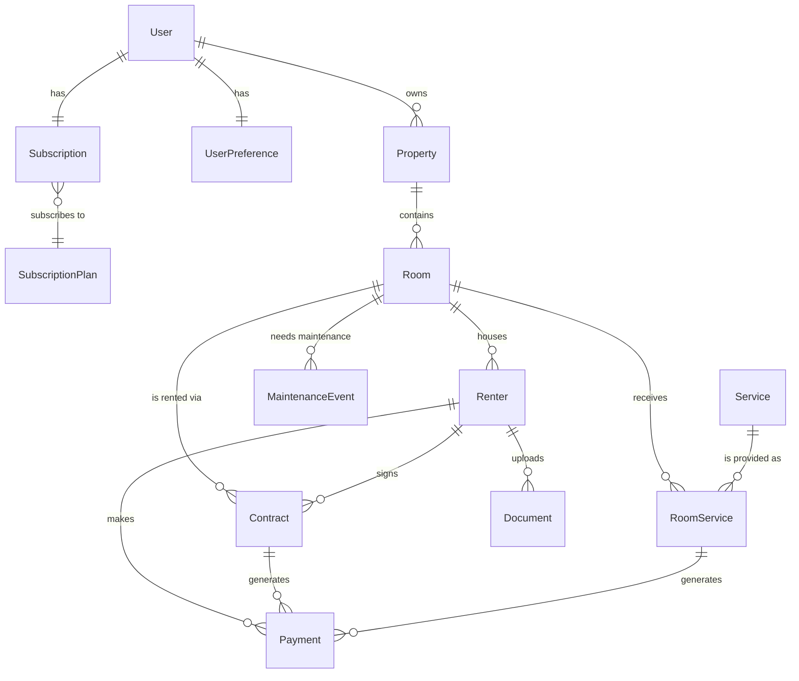

# Property Management System Database Diagram

## Entity-Relationship Diagram

## Key Entities and Relationships

### Core User Management
- **User** manages properties and has preferences and subscription
- **UserPreference** stores UI settings for each user
- **Subscription** links a user to a specific plan
- **SubscriptionPlan** defines features and pricing

### Property Management
- **Property** is owned by a user and contains rooms
- **Room** is the central entity connecting renters, contracts, services, and maintenance

### Renter Management
- **Renter** can be assigned to a room and has documents, contracts, and payments
- **Document** stores identification and paperwork for renters

### Contract & Payment
- **Contract** links a renter to a specific room with terms
- **Payment** can be for contracts or services

### Services & Maintenance
- **Service** defines available services (e.g., cleaning, internet)
- **RoomService** assigns specific services to specific rooms
- **MaintenanceEvent** tracks repairs and issues in rooms

### Financial Management
- **Expense** tracks business expenses (independent of other entities)

## Database Cardinality Notation

In the diagram:
- `||--||` represents a one-to-one relationship
- `||--o{` represents a one-to-many relationship
- `}o--||` represents a many-to-one relationship
- `}o--o{` represents a many-to-many relationship

## Implementation Notes

This diagram represents the logical relationships between entities as defined in the Prisma schema. The actual implementation includes:

1. UUID primary keys for all entities
2. Timestamp fields (createdAt, updatedAt) on all entities
3. Enum types for statuses and categories
4. Cascading deletes for dependent relationships
5. Optional fields where appropriate 