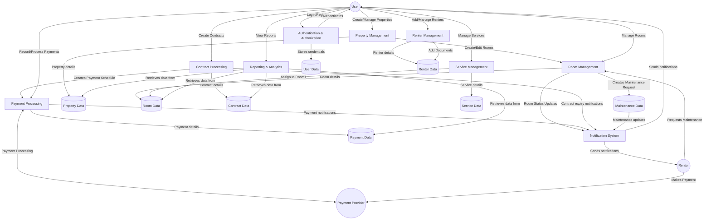

# Property Management System - Data Flow Diagram

## Core System Data Flows

## Key Data Flow Descriptions

### User Management Flow
1. User registers/logs in to the system
2. Authentication process validates credentials
3. User data is stored in the database
4. User accesses system features based on role and permissions

### Property & Room Management Flow
1. User creates and manages properties
2. Properties contain multiple rooms
3. Room status changes trigger notifications
4. Maintenance events are tracked for rooms

### Renter Management Flow
1. User adds renters to the system
2. Renters are assigned to rooms
3. Renter documents are stored and managed
4. Renter information links to contracts and payments

### Contract & Payment Flow
1. User creates contracts linking renters to rooms
2. Contracts generate payment schedules
3. Payments are processed and recorded
4. Payment status updates trigger notifications

### Service Management Flow
1. User defines available services
2. Services are assigned to specific rooms
3. Service charges generate payments
4. Service status changes are tracked

### Reporting Flow
1. System collects data from all modules
2. Analytics processes generate insights
3. User views dashboards and reports
4. Financial summaries are calculated

## System Notifications
- Contract expiration alerts
- Payment due/received notifications
- Maintenance request updates
- Occupancy status changes
- Subscription plan alerts

## Integration Points
- Payment gateway for online payments
- Email/SMS notification services
- Document storage systems
- Calendar integrations for scheduling